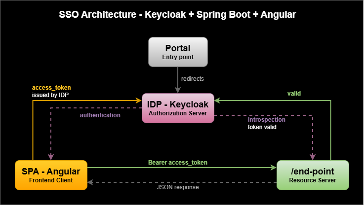

<div align="center">

# SSO Keycloak POC

**A proof-of-concept for centralized authentication using Keycloak, Spring Boot, and Angular.**

</div>

---

## Overview

This repository is a proof-of-concept (POC) demonstrating how to build **Single Sign-On (SSO)** from scratch using industry-standard protocols. It was built as portfolio material and accompanies a step-by-step article walking through every design decision.

The project shows how to:

- Configure **Keycloak** as a centralized Identity Provider (IdP)
- Implement the **Authorization Code + PKCE** flow in an Angular SPA
- Protect a **Spring Boot** REST API using OAuth2 Resource Server
- Validate access tokens via **Token Introspection** without sharing secrets with the frontend
- Wire everything together locally with **Docker Compose**

---

## Architecture



### Flow breakdown
 
| Step | Description |
|------|-------------|
| 1 | User opens the SPA and is redirected to Keycloak for authentication |
| 2 | Keycloak issues an `access_token` and returns it to the SPA via redirect |
| 3 | SPA sends a request to the Resource Server with the `access_token` as a Bearer token |
| 4 | Resource Server calls Keycloak's introspection endpoint to validate the token |
| 5 | Keycloak responds with token metadata; the Resource Server allows or denies the request |

---

## Tech Stack
 
| Layer | Technology |
|-------|-----------|
| Identity Provider | Keycloak 24.x |
| Backend | Java 21 · Spring Boot 3.x · Spring Security OAuth2 |
| Frontend | Angular 18 · keycloak-angular |
| Infrastructure | Docker · Docker Compose · PostgreSQL |
 
---

## Getting Started
 
### Prerequisites
 
- [Docker](https://docs.docker.com/get-docker/) and Docker Compose
- Java 21+ (for local backend development)
- Node.js 20+ (for local frontend development)

### 1. Clone the repository
 
```bash
git clone https://github.com/gustavo-as/sso-keycloak-poc.git
cd sso-keycloak-poc
```
 